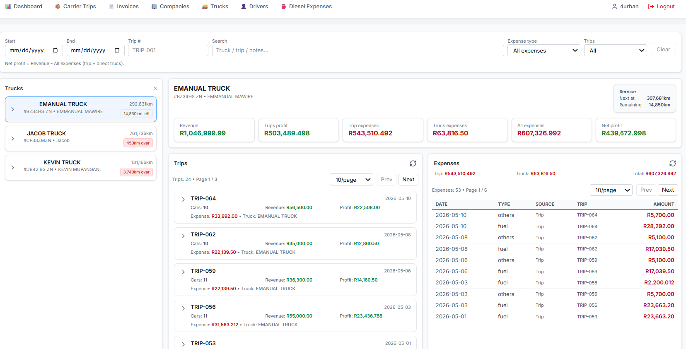
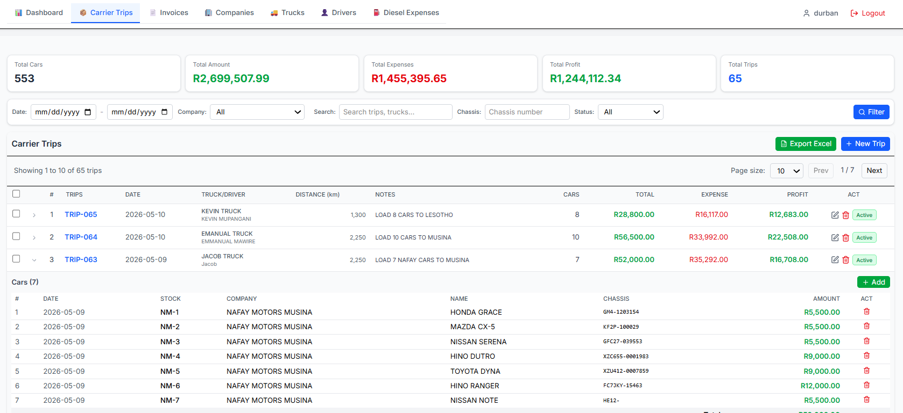
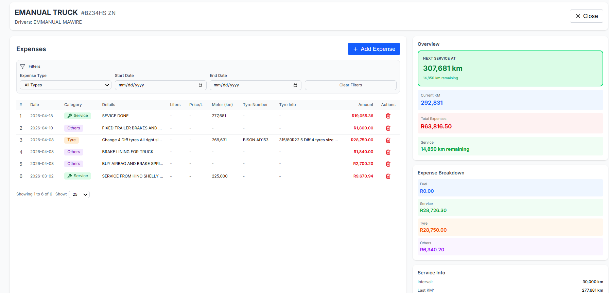
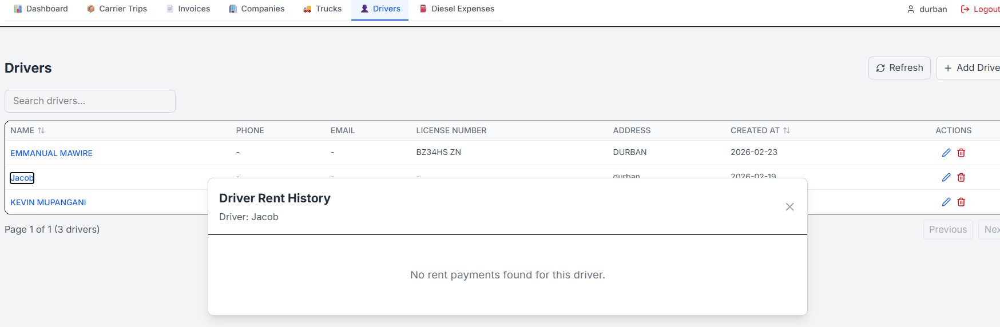
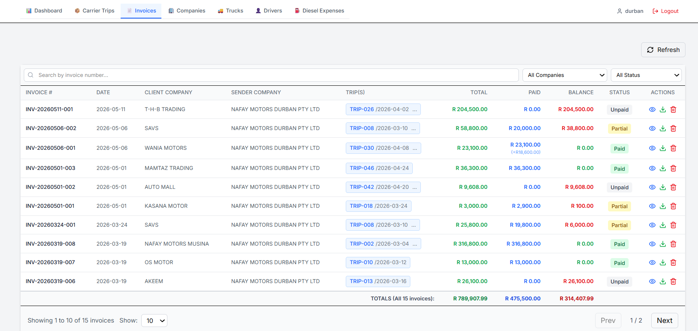
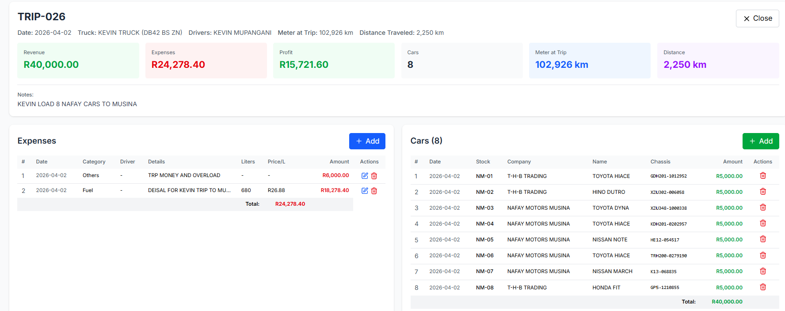
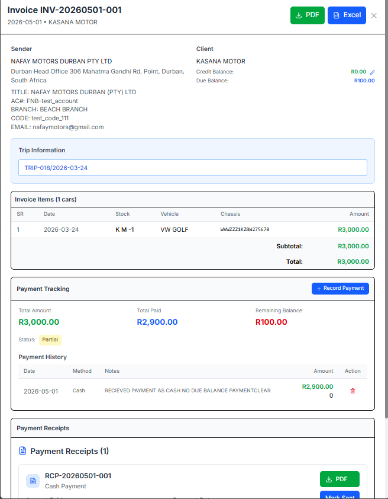

# Carrier Trip Management System

> A production-grade carrier trip management system built to track truck trips used for transporting vehicles across multiple companies. Manages trip logistics, vehicle records, drivers, receipts, financial transactions, and PDF invoice generation — all in one platform.

🚀 **Live System:** [nafaymotors-accounts-pkuc.vercel.app](https://nafaymotors-accounts-pkuc.vercel.app)

---

## Screenshots

### Dashboard


### Carrier Trips


### Trucks Management


### Drivers Management


### Invoices


### Invoice Details


### Receipts


---

## Overview

This system was built to replace manual Excel-based workflows used by a car dealership to manage carrier truck trips. Each carrier trip transports multiple vehicles from different companies. The system records all trip details, vehicle data, driver information, expenses, and automatically calculates profit per trip.

PDF invoices can be generated for any trip with flexible filtering — matching the exact format the business previously used manually.

---

## Key Features

### 📊 Dashboard
- At-a-glance summary of all active trips, trucks, and drivers
- Real-time financial overview across all carrier operations

### 🚛 Carrier Trip Management
- Create and manage carrier trips with unique trip numbers and dates
- Track total expenses per trip
- Auto-calculate profit: **Total Car Amounts − Total Expenses**
- View all trips with summary statistics at a glance

### 🚗 Vehicle Management
- Add single or multiple vehicles to a trip using bulk table entry
- Record stock number, chassis, car model, company, amount, and customer
- Auto-create companies when entering new vehicle data — no extra steps

### 🚚 Trucks Management
- Maintain a registry of all carrier trucks
- Assign trucks to specific trips
- Track truck operational details

### 👤 Drivers Management
- Record and manage driver information
- Assign drivers to carrier trips
- Track driver history across trips

### 🧾 Receipts
- Record and manage financial receipts per trip
- Full transaction history for each carrier operation

### 📄 PDF Invoice Generation
- Generate professional PDF invoices for any carrier trip
- Apply filters before generating (date, company, customer)
- Adjust and save trip expenses directly from invoice view
- Detailed invoice breakdown per trip

### 🏢 Multi-Company Support
- Track vehicles from multiple companies within a single trip
- Filter records by company, customer, or date range

---

## Tech Stack


| Layer | Technology |
|---|---|
| Frontend | Next.js 14, React.js |
| Backend | Next.js Server Actions |
| Database | MongoDB |
| PDF Generation | Client-side invoice renderer |
| Deployment | Vercel |
| Styling | Tailwind CSS |

---

## Database Schema


---

## Local Development

```bash
# Clone the repository
git clone https://github.com/nafaymotors17-ux/nafaymotors_accounts.git
cd nafaymotors_accounts

# Install dependencies
npm install

# Set up environment variables
# Create a .env.local file and add:
# MONGODB_URI=your_mongodb_connection_string

# Start the development server
npm run dev
```

Open [http://localhost:3000](http://localhost:3000) to view the app.

---

## Built By

**Abdul Hannan** — Backend Developer | Next.js · Node.js · MongoDB · REST APIs

[](https://linkedin.com/in/abdulhannan)
[](https://github.com/abdul-hannan-SE)
[](mailto:contact.hannan100@gmail.com)

---

*Built as a production system for a real business. Available for freelance backend and full-stack projects — feel free to reach out.*
